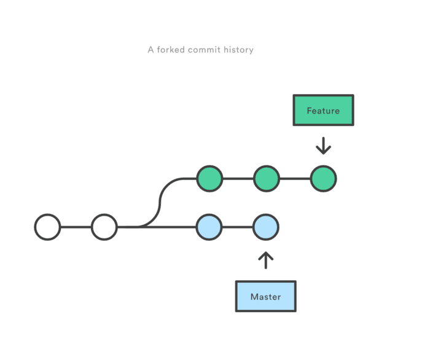
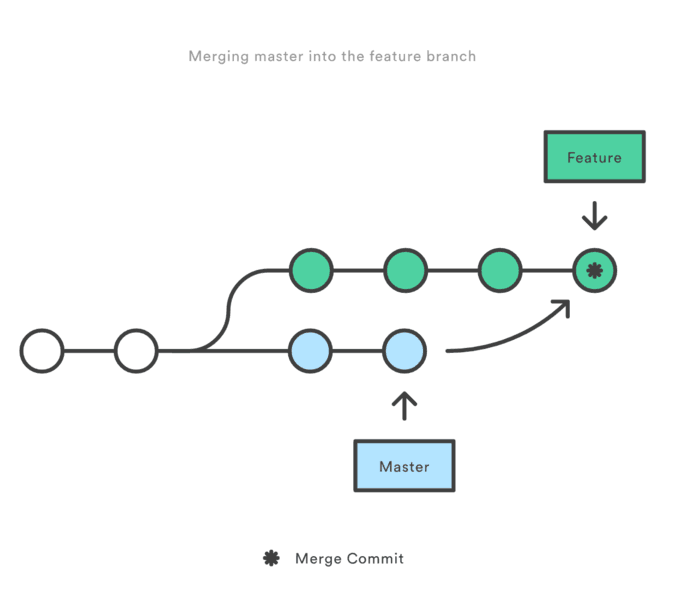
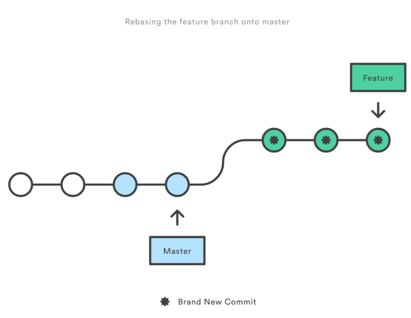

## Git rebase 和 merge 的抉择
### Description
> git rebase 和 git merge 一样都是用于从一个分支获取并且合并到当前分支，但是他们采取不同的工作方式，以下面的一个工作场景说明其区别

* 场景：

> 如图所示：你在一个feature分支进行新特性的开发，与此同时，master 分支的也有新的提交。



> 为了将master 上新的提交合并到你的feature分支上，你有两种选择：merging or rebasing

* merge

执行以下命令：

```
git checkout feature
git merge master
```
或者执行更简单的：

```
git merge master feature
```

那么此时在feature上git 自动会产生一个新的commit(merge commit)
look like this：



**marge 特点：自动创建一个新的commit
如果合并的时候遇到冲突，仅需要修改后重新commit
优点：记录了真实的commit情况，包括每个分支的详情
缺点：因为每次merge会自动产生一个merge commit，所以在使用一些git 的GUI tools，特别是commit比较频繁时，看到分支很杂乱。**

* rebase

本质是变基 变基 变基
变基是什么?  找公共祖先
共同祖先是什么? 

执行以下命令：

```
git checkout feature
git rebase master
```
look like this:



**rebase 特点：会合并之前的commit历史
优点：得到更简洁的项目历史，去掉了merge commit
缺点：如果合并出现代码问题不容易定位，因为re-write了history**

合并时如果出现冲突需要按照如下步骤解决

修改冲突部分
1.git add
2.git rebase --continue
（如果第三步无效可以执行  git rebase --skip）
**不要在git add 之后习惯性的执行 git commit命令**

### Summary

> 如果你想要一个干净的，没有merge commit的线性历史树，那么你应该选择git rebase
如果你想保留完整的历史记录，并且想要避免重写commit history的风险，你应该选择使用git merge